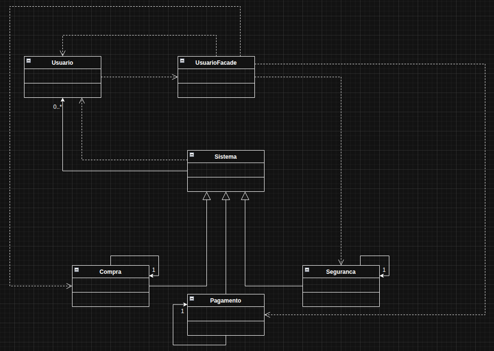

# Façade

O Façade é um padrão de projeto estrutural que oferece uma interface simples para um sistema complexo. Resumindo: em vez de lidar com várias classes e detalhes internos, você usa uma única classe que facilita o acesso às funcionalidades.

No exemplo usado foi pensado em um sistema de notificações de um e-commerce, onde verificaria se o usuário possui alguma notificação pendente para ser avisado, sobre segurança, alguma compra ou algum pagamento feito.

